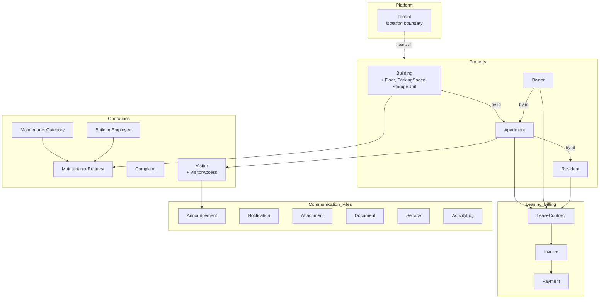

# Domain Model

The heart of 3martna: a **rich, framework-independent** domain (ADR-0006).
Entities live in `backend/src/domain/business/`, depend on nothing but
`domain/common`, and enforce their own invariants. This document explains the
aggregates, their boundaries, and the relationships between them.

## Building blocks (`domain/common`)

| Type | Responsibility |
|---|---|
| `Entity` | Base of every business entity: `id`, `tenantId`, audit stamps, `isDeleted`, `rowVersion`, plus `touch()` / `softDelete()`. Fields are private; mutation is via intention-revealing methods. |
| `DomainError` | Thrown when a business invariant is violated. Mapped to HTTP 422 by the presentation layer. |
| `Money` | Immutable value object; 2-dp rounding; refuses cross-currency arithmetic. |
| `DateRange` | Immutable half-open `[start, end)` range; containment & overlap tests. |
| `newId()` | GUID generation (`crypto.randomUUID`) for new aggregates. |

Construction is always through **static factories** (`Building.create`,
`LeaseContract.draft`, `Invoice.draft`, …) that validate inputs. Rehydration
from persistence uses `restore(props)`. Each entity exposes `toProps()` for the
mapping layer — the only way data leaves the domain.

## Aggregate map

Solid arrows are **references by id** across aggregate boundaries — aggregates
never hold object references to one another. Dotted = tenant ownership.

## Aggregate roots

Each root is a consistency boundary: it is loaded and saved as one unit, and it
alone enforces the invariants of the data it owns.

### Tenant
The customer and the **isolation boundary** (ADR-0004). Every other entity's
`tenantId` points at a Tenant. Lifecycle: `Active ⇄ Suspended`. A Tenant's own
`tenantId` equals its id.

### Building *(owns Floor, ParkingSpace, StorageUnit)*
A physical building. Floors are created **only** through the root
(`building.addFloor`), which enforces unique floor numbers. Parking spaces and
storage units are children too. Lifecycle:
`Active ⇄ UnderConstruction`, `→ Inactive`. Apartments are deliberately a
**separate** aggregate (below).

### Apartment
A rentable unit — split from Building because it is the contention hot-spot
(leases, maintenance, visitors, invoices all reference it). Rich status machine:
`Available → {Leased, OwnerOccupied, UnderMaintenance, Reserved}` with only
legal transitions permitted. Owner assignment is required before
`OwnerOccupied`.

### Owner
The legal owner (Individual or Company) of apartments. Company owners must have
a company name. Optionally links (once) to a `User` account.

### Resident
A person living in an apartment. History is preserved by `moveOut()` (sets
`moveOutDate`) rather than deletion; `isActive` derives from it. Optional
one-time `User` link.

### LeaseContract
The lease between an Owner (lessor) and Resident (lessee) over an Apartment.
Lifecycle: `Draft → Active → {Expired, Terminated}`, or `Draft → Cancelled`.
Termination requires a reason; `expire()` refuses to run before the end date.
The **one-active-lease-per-apartment** rule is enforced by the domain plus the
filtered unique index `UQ_LeaseContracts_ActivePerApartment`. Uses `Money` and
`DateRange`.

### Invoice
A bill issued to **exactly one** party (Resident XOR Owner —
`CK_Invoices_BilledParty`). Status is always **derived**, never set directly:
`recordPayment()` moves `Issued → PartiallyPaid → Paid` and rejects
over-payment; `applyLateFee()` is single-shot; `markOverdue()` requires a past
due date. Cancellation is blocked once any payment exists.

### Payment
Money received against an invoice. Financial records are **append-only**: a
wrong payment is `reject()`-ed, never deleted. Bank transfers require a
reference number. `Pending → {Confirmed, Rejected}`.

### MaintenanceRequest *(with MaintenanceCategory)*
A work request with a strict state machine:
`Open → Assigned → InProgress → {OnHold, Completed}`, with `Cancelled` /
`Rejected` off the early states. `assign()` sets an employee, `start()` requires
one, `escalate()` bumps priority, and `rate()` is requester-only, once, only
after completion. `MaintenanceCategory` is a tenant-configurable lookup root.

### Complaint
A resident complaint with enforced anonymity: when `isAnonymous`, no
`submittedByUserId` is ever stored (domain guard + `CK_Complaints_Anonymous`).
`Open → InReview → {Resolved, Dismissed}`, `Escalated` in between; resolution
and dismissal require a note.

### Visitor *(owns VisitorAccess)*
A person a resident expects. Passes are issued through the root
(`visitor.issueAccess`). **VisitorAccess** carries a GUID QR `accessCode` and a
validity window, with a gate lifecycle:
`Pending → Approved → CheckedIn → CheckedOut`, plus `Denied/Expired/Cancelled`.
`checkIn()` validates both approval and the time window.

### BuildingEmployee
A staff assignment linking a User to a Building in a role
(Manager/Maintenance/Security/…). Ending an assignment (`end()`) preserves
history; `isActive` derives from `endedOn`. A filtered unique index prevents
duplicate active assignments.

### Announcement / Notification
**Announcement** — a broadcast scoped to a building or the whole tenant, with
audience targeting, pinning and optional expiry. **Notification** — a
per-user in-app message; `markRead()` is idempotent.

### Attachment / Document
**Attachment** — a file bound to another entity via polymorphic
`(entityType, entityId)`; binaries live in Firebase Storage, only URLs here.
**Document** — a first-class managed document with **version chaining**:
`newVersion()` returns a new aggregate pointing at its predecessor.

### Service
A chargeable building service (cleaning, gym, internet), scoped to a building or
tenant-wide, with an optional `Money` monthly fee and active/inactive state.

### ActivityLog
The business-facing, append-only activity feed (who did what, per tenant).
Distinct from the security `AuditLog` (identity domain): this is user-visible
product history.

## Why these boundaries

- **Building vs Apartment** are separate aggregates: an apartment changes far
  more often (leases, maintenance, visitors) than its building, so coupling
  their persistence would create contention and oversized loads.
- **Invoice owns payment application** (the paid total and derived status) even
  though `Payment` is its own append-only aggregate — money math has one home.
- **Cross-aggregate references are by id**, so each aggregate stays small,
  independently loadable, and testable without a database (the domain test
  suite runs with zero infrastructure).

## Persistence & concurrency

Every entity carries a `rowVersion` mirrored from SQL Server's `ROWVERSION`
column. Repository `save()` (interfaces in
`domain/repositories/business/`, implementations in a later sprint) performs an
optimistic-concurrency upsert: a stale write is rejected rather than silently
overwriting a concurrent change.
