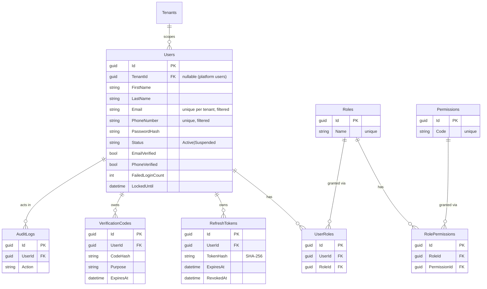
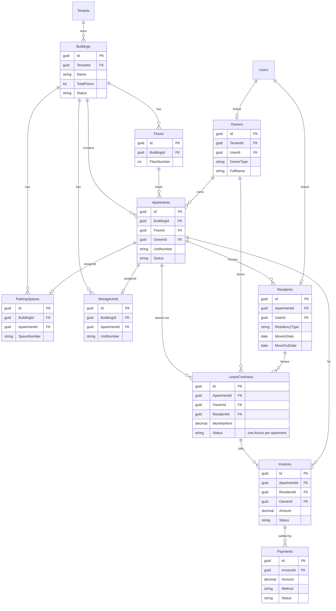
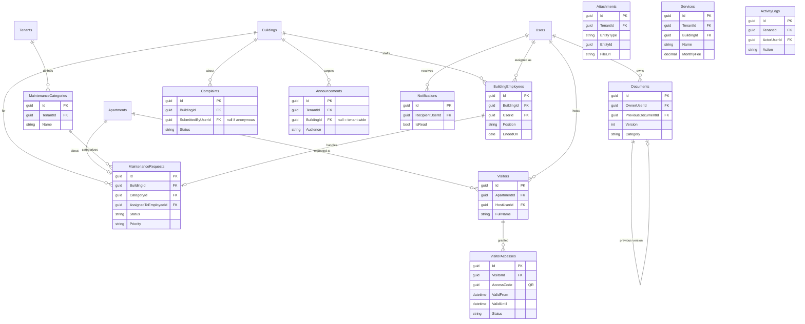

# Entity–Relationship Diagram

Microsoft SQL Server schema after migrations `0001_identity` and
`0002_core_domain`. Every table also carries the standard columns
(`CreatedAt`, `UpdatedAt`, `CreatedBy`, `UpdatedBy`, `IsDeleted`, `RowVersion`)
and — for business tables — `TenantId`; these are omitted from the diagram for
readability. All primary keys are `UNIQUEIDENTIFIER` (GUID, ADR-0003).

## Identity domain (migration 0001)

## Property & leasing (migration 0002)

## Operations & communication (migration 0002)

## Key constraints & indexes

| Kind | Example | Purpose |
|---|---|---|
| Tenant-scoped unique | `UQ_Buildings_Tenant_Name (TenantId, Name)` filtered on `IsDeleted=0` | Names unique within a tenant, deleted rows free the value |
| Business invariant | `UQ_LeaseContracts_ActivePerApartment (ApartmentId) WHERE Status='Active'` | At most one active lease per apartment |
| Billed-party XOR | `CK_Invoices_BilledParty ((ResidentId IS NULL) <> (OwnerId IS NULL))` | An invoice bills exactly one party |
| Anonymity | `CK_Complaints_Anonymous (IsAnonymous=0 OR SubmittedByUserId IS NULL)` | Anonymous complaints never store a submitter |
| Hot-path index | `IX_*_Tenant_* (TenantId, …)` leading column | Partition-aligned tenant queries |
| Concurrency | `RowVersion ROWVERSION` on every table | Optimistic concurrency |
